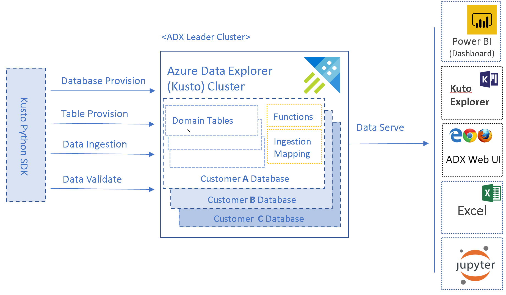
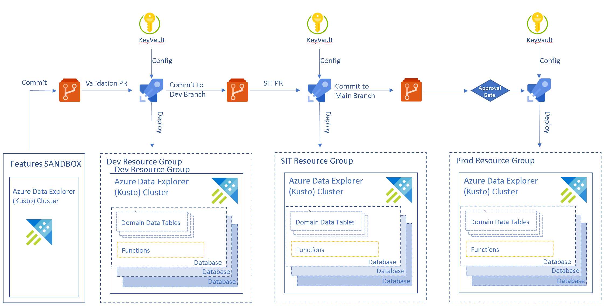
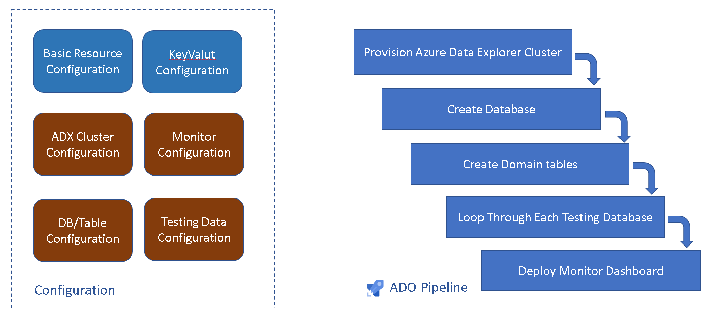
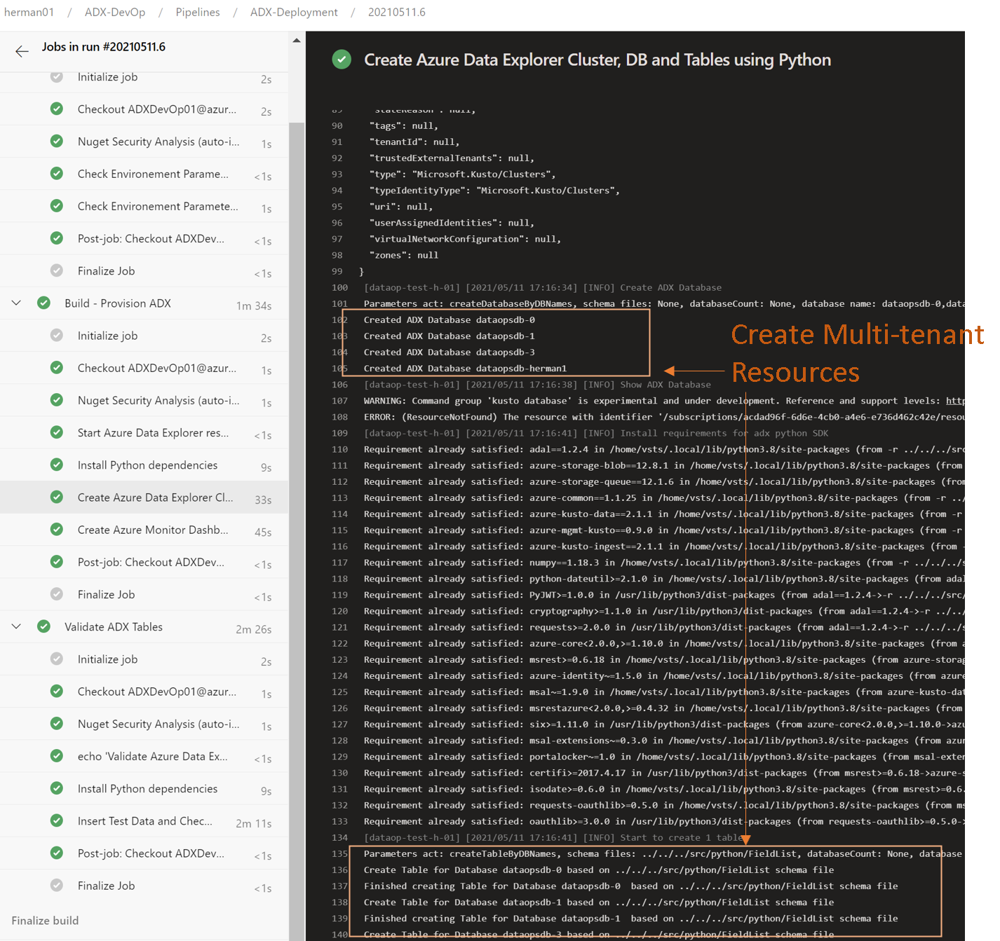
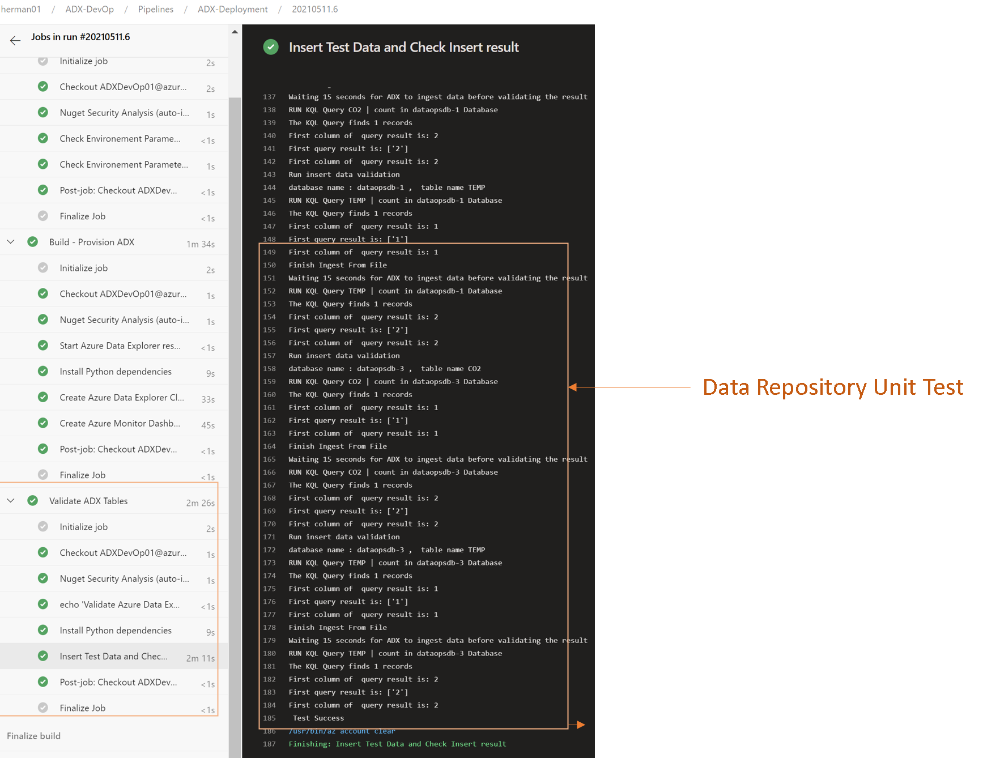
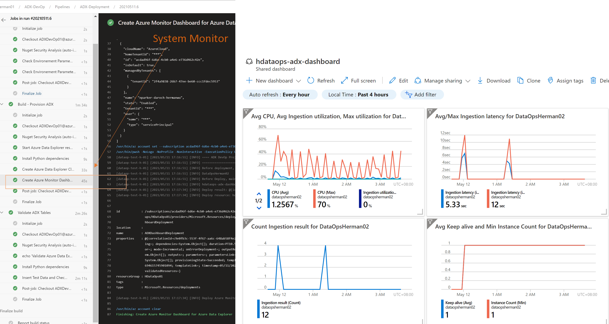

# Azure Data Explorer

This sample demonstrates the CI/CD process to create an multi-tenant Azure Data Explorer cluster. [Azure Data Explorer](https://azure.microsoft.com/en-us/services/data-explorer/#features) is a fast, fully managed data analytics service for large volumes of data ingesting from applications, websites, IoT devices, and more. 

The following sample demonstrates how you can create CI/CD pipelines to provision Azure Data Explorer services and deploy database changes to it.  

## Contents

Contents of this sample includes: 

- [Azure Data Explorer](#azure-data-explorer)
  - [Contents](#contents)
  - [Solution Overview](#solution-overview)
    - [Architecture](#architecture)
    - [Continuous Integration and Continuous Delivery](#continuous-integration-and-continuous-delivery)
    - [Technologies used](#technologies-used)
  - [Key Learning](#key-learning)
  - [Key Concepts](#key-concepts)
  - [How to use the sample](#how-to-use-the-sample)
    - [Prerequests](#prerequests)
    - [Software Prequests](#software-prequests)
    - [Setup and Deployment](#setup-and-deployment)
    - [Run the sample](#run-the-sample)
    - [Known Issues, Limitation and Workarounds](#known-issues-limitation-and-workarounds)

## Solution Overview

The solution will demonstrate how to use the CI/CD process to create an multi-tenant Azure Data Explorer cluster. We use [Multi-tenant app with database-per-tenant](https://docs.microsoft.com/en-us/azure/azure-sql/database/saas-tenancy-app-design-patterns#d-multi-tenant-app-with-database-per-tenant) design.   It will create multiple databases on an scalable ADX cluster to provide a cost-effective way of sharing resources across many databases. 

The solution setups up an Azure Data Explorer cluster with multiple databases. Each databases will share same table schema. It also includes ADX configuration file and a key vault for secrets. The table schema of databases are defined in [Kusto query language](https://docs.microsoft.com/en-us/azure/data-explorer/kusto/concepts/#:~:text=Kusto%20query%20language%20is%20primary%20means%20of%20interaction.,queries%20and%20control%20commands%20are%20short%20textual%20%22programs%22.). 

In the CI/CD process, to test and validate the deployment, we will insert sample data into the provisioned tables and validate the result. 

We will also create Azure Dashboard to monitor the key matrics of Azure Data Explorer cluster. 

### Architecture 

The following shows the architecture of the Azure Data Explorer multi-tenancy deploy and configure architecture. 

### Continuous Integration and Continuous Delivery
The following shows CI/CD flow based on the ADX DevOp pipeline.  

### Technologies used
- [Azure Data Explorer](https://azure.microsoft.com/en-us/services/data-explorer/)
- [Azure Key Vault](https://azure.microsoft.com/en-us/services/key-vault/) 
- [Azure DevOps](https://docs.microsoft.com/en-us/azure/devops/?view=azure-devops)
- [Python 3.6+](https://www.python.org/downloads/release/python-360/)
- [Powershell Core (run on Ubuntu)](https://github.com/PowerShell/PowerShell)

## Key Learning 

The following summarizes key learnings and best practices demonstrated by this sample solution

__1. Use a centralize configuration file to store ADX cluster provision parameters__

Azure Data Explorer is a powerful data analytics platform. To optimize it's performance based on different workload, a lot of parameters can be set and choose. We put these parameters in a central configuration files to simply the configuration and management effort. 

__2. Include  multi-tenancy resource creation as part of IaC (Infrastructure as Code).__

We saw many companies leverage Azure Data Explorer to build powerful data analytical application to serve their customers. In the sample we will demonstrate how to include multi-tenancy resource creation as part of IaC. With that implementation, it not only helps simply the  validation multi-tenant implementation but also help company to easily track multi-tenancy implementation change.  

__3. Use sample data to test the resource provision result.__  

After provision the cluster, database and tables, we want to validate and testing if we have a ready data repository for applications. We use sample data that mimic real data to do the end-to-end ingestion and query testing so we can make sure the provisioned tables meet the requirements and are ready for use. 

__4. Store secrets in Azure Key Vault__

## Key Concepts

__1. Azure Data Explorer Configuration settings__

Azure Data Explorer has several components inside it, and each components could be configured with certain parameters to optimize it's performance . To simply the configuration, we put the most common configuration in a centralized JSON document so users can easily understand all the settings. The deployment script will provision ADX cluster based on the JSON.     

__2.  multi-tenancy setting and ADX Python Utility__  

To provide better flexibilities to support multi-tenancy deployment, we build an ADXUtiltiy liberary based on Kusto python SDk. The utility library can read multi-tenancy setting and deploy the corresponding database and tables. 
The multi-tenancy setting are in XXX files. 

ADX utility library also support data insert and data query, we use it to insert  sample data into tables to validate if we have right configuration for multi-tenancy data. 

__3. Provision Pipeline__

We use ADO pipeline to provision the ADX cluster resources and connect each actions together. Azure ADO pipeline helps to define the CI/CD process. 

- Following is the ADX pipeline in the sample

## How to use the sample 

### Prerequests 
- [Azure  Account](https://azure.microsoft.com/en-us/free) 
- [Azure DevOps Account](https://azure.microsoft.com/en-us/services/devops/?nav=min)
- [GitHub account](https://github.com/)

### Software Prequests
- [Azure CLI](https://docs.microsoft.com/en-us/cli/azure/install-azure-cli) 
- [Powershell Core 7.x](https://docs.microsoft.com/en-us/powershell/scripting/whats-new/what-s-new-in-powershell-70?view=powershell-7.1)
- [Python 3.6+](https://www.python.org/downloads/release/python-360/)
- [Kusto Python SDK](https://docs.microsoft.com/en-us/azure/data-explorer/kusto/api/python/kusto-python-client-library) 

### Setup and Deployment

To setup the samples, run the following:

1. **Initial Setup**
   1. Ensure that:
      - You are logged in to the Azure CLI. To login, run `az login`.
      - Azure CLI is targeting the Azure Subscription you want to deploy the resources to.
         - To set target Azure Subscription, run `az account set -s <AZURE_SUBSCRIPTION_ID>`
      - Azure CLI is targeting the Azure DevOps organization and project you want to deploy the pipelines to.
         - To set target Azure DevOps project, run `az devops configure --defaults organization=https://dev.azure.com/<MY_ORG>/ project=<MY_PROJECT>`
   2. **Import** this repository into a new Github repo. See [here](https://help.github.com/en/github/importing-your-projects-to-github/importing-a-repository-with-github-importer) on how to import a github repo. Importing is necessary for setting up git integration with Azure Data Factory.
   3. Set the following **required** environment variables:
       - **GITHUB_REPO** - Name of your imported github repo in this form `<my_github_handle>/<repo>`
       - **GITHUB_PAT_TOKEN** - a Github PAT token. Generate them [here](https://github.com/settings/tokens). This requires "repo" scope.

       Optionally, set the following environment variables:
       - **RESOURCE_GROUP_LOCATION** - Azure location to deploy resources. *Default*: `westus`.
       - **AZURE_SUBSCRIPTION_ID** - Azure subscription id to use to deploy resources. *Default*: default azure subscription. To see your default, run `az account list`.
       - **RESOURCE_GROUP_NAME_PREFIX** - name of the resource group. This will automatically be appended with the environment name. For example: `RESOURCE_GROUP_NAME_PREFIX-dev-rg`. *Default*: mdwdo-ado-${DEPLOYMENT_ID}.
       - **DEPLOYMENT_ID** - string appended to all resource names. This is to ensure uniqueness of azure resource names. *Default*: random five character string.
       - **AZDO_PIPELINES_BRANCH_NAME** - git branch where Azure DevOps pipelines definitions are retrieved from. *Default*: master.

      To further customize the solution, set parameters in `arm.parameters` files located in the `infrastructure` folder.

2. **Deploy Azure resources**
   1. Clone locally the imported Github Repo, then `cd` into the `single_tech_samples/datafactory` folder of the repo
   2. Run `./deploy.sh`.
      - After a successful deployment, you will find `.env.{environment_name}` files containing essential configuration information per environment. See [here](#deployed-resources) for list of deployed resources.
   3. As part of the deployment script, this updated the Azure DevOps Release Pipeline YAML definition to point to your Github repository. **Commit and push up these changes.**

### Run the sample

1. **Create Service Principle for deploying resources**

    update KeyValut 

2. **Modify the configuration files**

3. **Run the pipeline to deploy the resources**

Validate all test are successful 

4. Check the Azure Monotor to see the whole system run. 

### Known Issues, Limitation and Workarounds